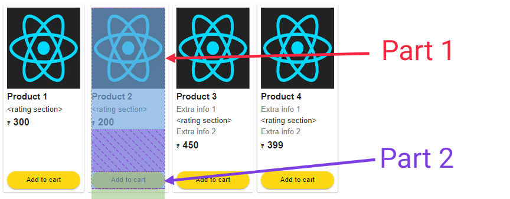

# My observations and fixes
I will be using lot of apps in my day-to-day life. As a Software developer, when I feel that there is some issue in the application and that can be fixed. I will be breaking down the issue and will provide the information about how this can be solved in the web development.

### Important Points
1. It is recommended to use a VS code extension called **Better Comments**
2. All **page.tsx** files have the description explaining about the issue and code to fix.

## Observations
### Observation 1
Inconsistent placement of 'add to cart button'  
**Observed issue**

**Fixed the issue**

